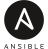

# :koala: Beep Boop! I'm Tobias

### I'm a full-stack developer with a special interest for automation

## Favorite Tech

> Stuff I used over the years that I really like (in no particular order)

<table>
    <tr>
        <td align="center" width="96">
            <a href="https://en.wikipedia.org/wiki/C++">
                 C++
            </a>
        </td>
        <td align="center" width="96">
            <a href="https://en.wikipedia.org/wiki/C_Sharp_(programming_language)">
                 C#
            </a>
        </td>
        <td align="center" width="96">
            <a href="https://www.typescriptlang.org/">
                 TypeScript
            </a>
        </td>
        <td align="center" width="96">
            <a href="https://en.wikipedia.org/wiki/JavaScript">
                 JavaScript
            </a>
        </td>
        <td align="center" width="96">
            <a href="https://sass-lang.com/">
                 Sass
            </a>
        </td>
        <td align="center" width="96">
            <a href="https://deno.land/">
                 Deno
            </a>
        </td>
        <td align="center" width="96">
            <a href="https://nodejs.org/">
                 Node.js
            </a>
        </td>
        <td align="center" width="96">
            <a href="https://kubernetes.io/">
                 Kubernetes
            </a>
        </td>
        <td align="center" width="96">
            <a href="https://www.ansible.com/">
                 Ansible®
            </a>
        </td>
    </tr>
</table>

<!--

### Hi there 👋

**FaustTobias/fausttobias** is a ✨ _special_ ✨ repository because its `README.md` (this file) appears on your GitHub profile.

Here are some ideas to get you started:

- 🔭 I’m currently working on ...
- 🌱 I’m currently learning ...
- 👯 I’m looking to collaborate on ...
- 🤔 I’m looking for help with ...
- 💬 Ask me about ...
- 📫 How to reach me: ...
- 😄 Pronouns: ...
- ⚡ Fun fact: ...
-->
